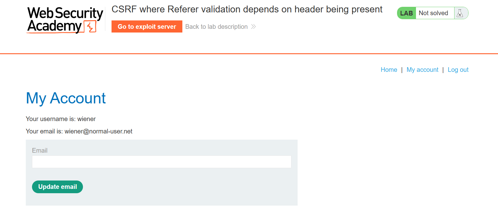
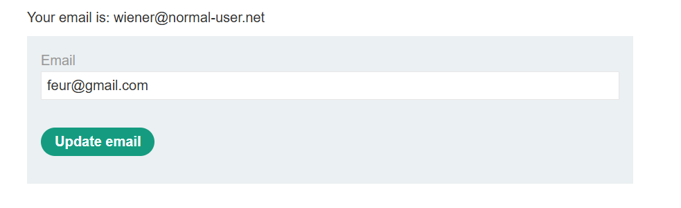
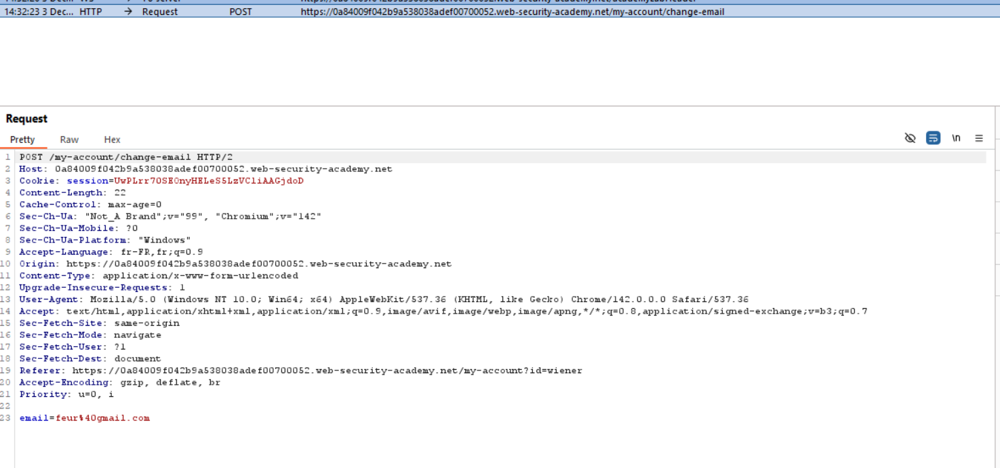
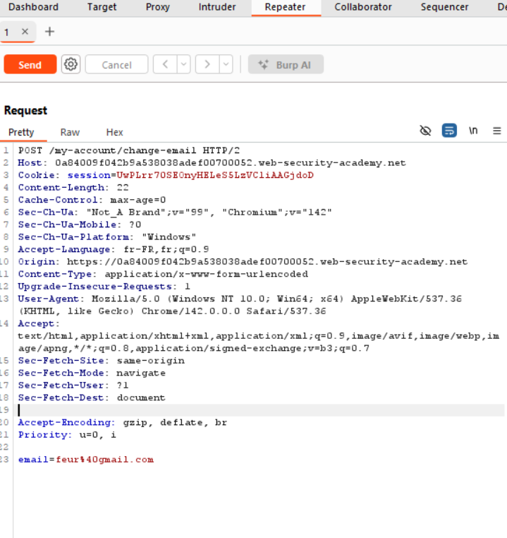
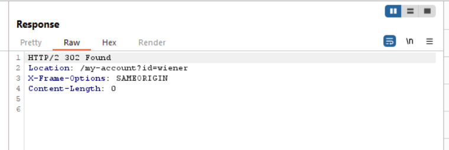
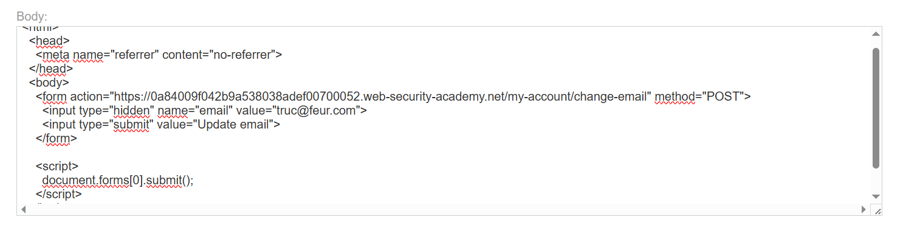

# CSRF where Referer validation depends on header being present

https://portswigger.net/web-security/csrf/bypassing-referer-based-defenses/lab-referer-validation-depends-on-header-being-present

## Découvertes de la vulnérabilité

---

L'analyse de la fonctionnalité de changement d'email révèle une validation basée sur l'en-tête `Referer`.

---

Un test manuel via le Repeater montre qu'en supprimant complètement la ligne `Referer`, la requête est acceptée.

---

Le serveur retourne un code `302 Found`. La validation ne s'applique que si l'en-tête est présent.

---

Pour exploiter cette faille logique, nous utilisons la balise `<meta name="referrer" content="no-referrer">` dans l'exploit. Cela force le navigateur de la victime à ne pas envoyer le `Referer`.

---

## Résultat:

L'exploit est délivré à la victime. La requête est traitée sans Referer et l'email est modifié.

---

## Recommandations de sécurisation:

- Si validation par Referer : rejeter la requête si l'en-tête est absent ou null.
- Configurer les cookies de session avec l'attribut `SameSite=Strict`.