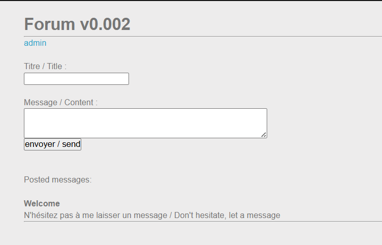
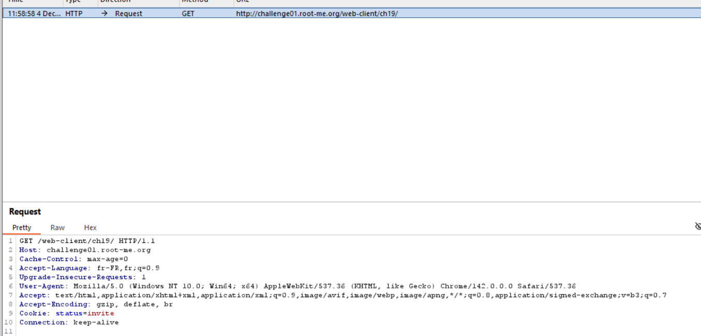
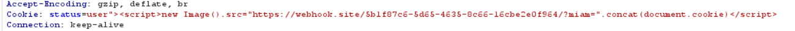
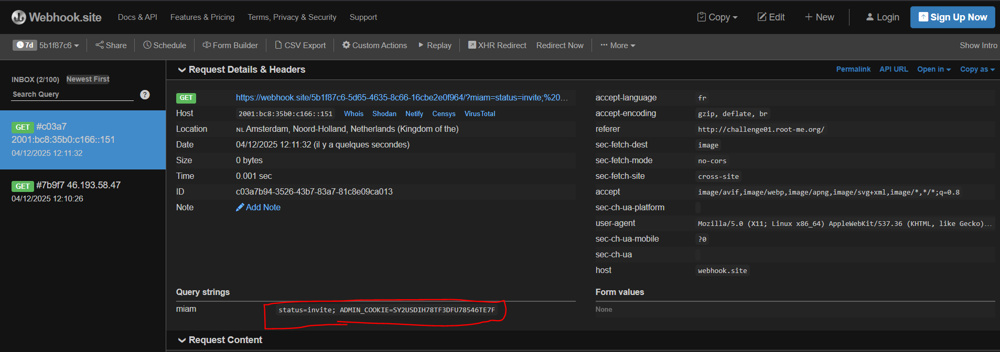
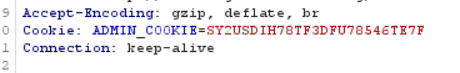
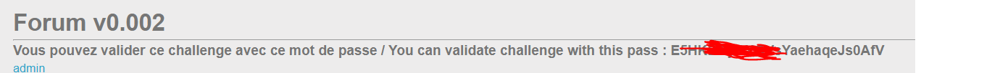

# XSS Stockée 2

https://www.root-me.org/fr/Challenges/Web-Client/XSS-Stockee-2

## Découvertes de la vulnérabilité

L'analyse des échanges HTTP révèle que le paramètre `status` transmis via le cookie est réfléchi sur la page sans assainissement adéquat.

---

Nous interceptons la requête avec un proxy (Burp Suite) pour injecter une charge utile JavaScript dans l'en-tête `Cookie`. L'objectif est de fermer la balise HTML existante et d'exécuter un script qui instancie une image pointant vers notre serveur d'écoute, concaténant le cookie de l'administrateur dans l'URL.

Payload : `status=user">`

---

Une fois que le robot administrateur visite la page, le script s'exécute. Notre serveur d'écoute (Webhook.site) reçoit une requête GET contenant le cookie de session de l'administrateur (`ADMIN_COOKIE`) dans les paramètres d'URL.

---

Nous exploitons cette information pour usurper la session de l'administrateur. Dans le Repeater ou via l'intercepteur, nous remplaçons notre cookie par celui récupéré (`ADMIN_COOKIE=...`).

---

## Résultat:

Le serveur valide l'authentification via le cookie volé. Nous accédons à l'interface administrateur et le mot de passe de validation (flag) est affiché.

---

## Recommandations de sécurisation:

- **Échappement des données :** Encoder les caractères spéciaux (entités HTML) de toutes les données issues des entrées utilisateurs (y compris les en-têtes HTTP) avant de les insérer dans le DOM.
- **Attribut HttpOnly :** Configurer les cookies de session avec le drapeau `HttpOnly` pour empêcher leur lecture via JavaScript (`document.cookie`), rendant le vol de session par XSS impossible.