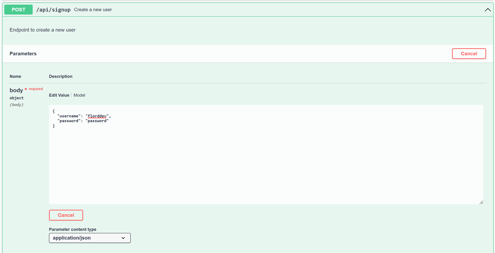
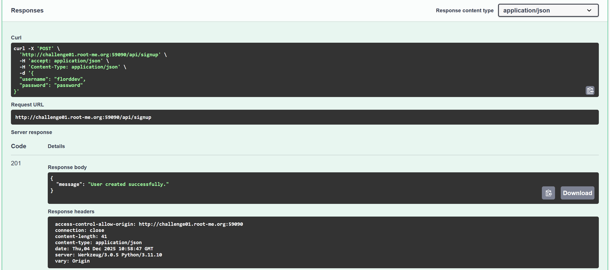
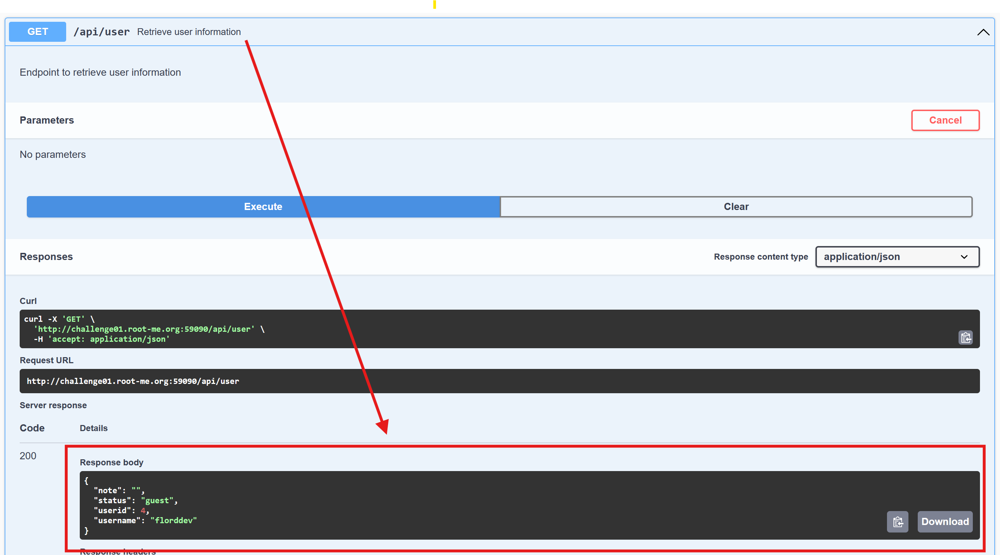
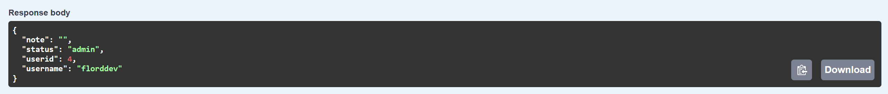
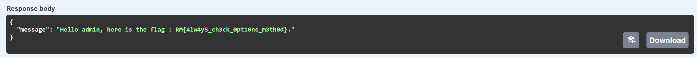

# API - Mass Assignment

https://www.root-me.org/fr/Challenges/Web-Serveur/API-Mass-Assignment

## Découvertes de la vulnérabilité

Sur l'api il est possible d'effectuer différentes requetes comme la création de compte, le login etc. Nous commencons alors par se créer un compte:




Notre compte à bien été créé, après nous pouvons executer la requete de login avec les meme identifiant renseigné pour la création du compte pour se connecté à notre compte, nous aurons alors un message de succès à la suite de cette requete.

Une fois cela fais, en executant la requete GET /api/user nous pouvons consulter les informations de notre compte:



En consultant la réponse on peut remarqué qu'a la création de notre compte le status `guest` nous à été attribué, en testant alors une simple requet fetch en PUT dans la console du navigateur, on tombe sur une erreur 401, et pas une erreur 404, cela signifie que la route la route fonctionne belle est bien, et qu'il serais possible de modifier le status via cette route. On execute alors le code suivant dans la console:

```js
fetch('/api/user', {
	method: 'PUT', 
	headers: {'Content-Type': 'application/json'}
	body: JSON.stringify({
  	    "status": "admin"
	}),
})
```

## Résultat

Une fois la requet fetch executé, si l'on re-execute la requete en GET on constate qu'au retour de la requete notre compte est bien passé en administrateur



Il ne nous reste alors plus qu'a executer la requete `api/flag` qui nous donnera le flag admin:



## Recommandations de sécurisation

- Sécurisation des routes via le status
- Empecher la modification du status coté api
- Bloquer la modification du status si pas admin
- Modifier la route de modification